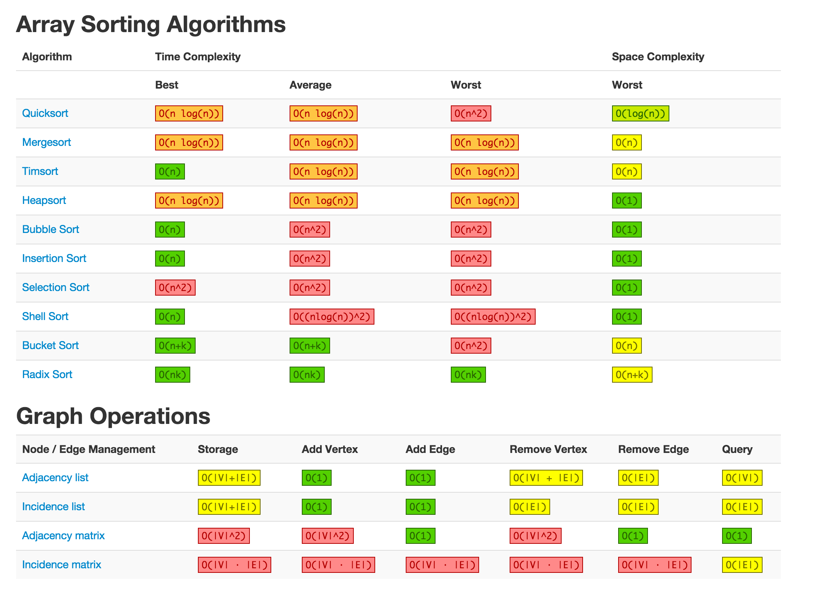
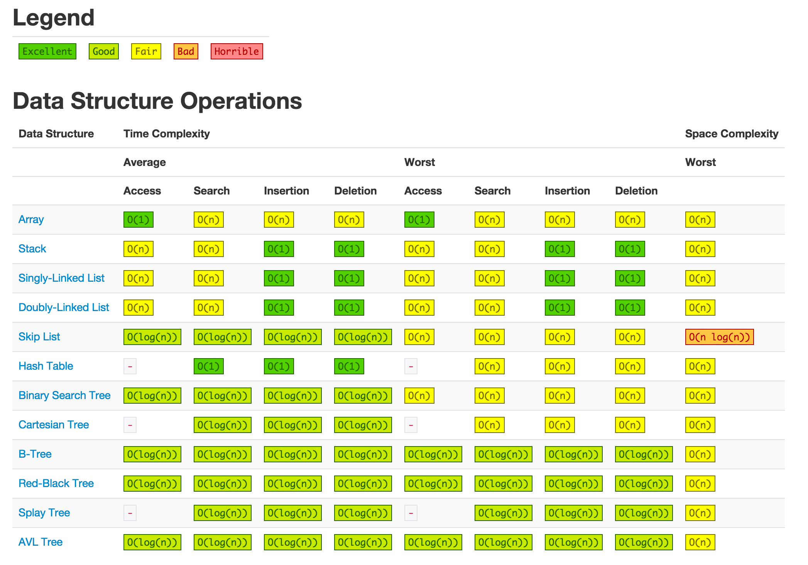

# Algorithm

### Definition

* An algorithm is a step by step method of solving a problem
* It is commonly used for data processing, calculation and other related computer and mathematical operations


### Types of Algorithm Strategy

* Brute Force Algorithm
* Greedy Algorithm
* Divide and Conquer
* Backtracking
* Branch and Bound Method
* Dynamic Programming

---
# Algorithm Efficiency

The process of measuring the complexity of algorithms is called analysis of algorithms

* All log are in base2

### Complexity
* Time Complexity – The time it takes to execute
* Space Complexity –The memory it needs to execute

### Different Cases of Running time
* Best-case
  * The algorithm takes the least time and it can do no better than that
* Worst-case
  * The algorithm takes the most time and it can do no worse than that
  * Worst-case count = maximum count
* Average-case
  * The average case on take typical data
  * Often difficult to determine

---

## Big-Oh ( $O$ )

### Definition

Let $f$ and $g$ be functions from the set of positive real numbers to the set of positive real numbers. We say that $f(x)$ is $O(g)$ if there are positive constants $c_2$, and $k$ (whenever $x > k$) such that:

$$
f(x) \leq c_2 g(x)
$$

* Upper bounded by $c \cdot g(n)$
* $f(n)$ dominated $g(n)$

### How to find Big-O:

1. Drop lower-order terms
2. Drop constant factors


## Big-Omega ( $\Omega$ )

### Definition

Let $f$ and $g$ be functions from the set of positive real numbers to the set of positive real numbers. We say that $f(x)$ is $\Omega(g)$ if there are positive constants $c_1$, and $k$ (whenever $x > k$) such that:

$$
c_1 g(x) \leq f(x)
$$

* Lower bounded by $c \cdot g(n)$
* $f(n)$ dominates $g(n)$


## Big-Theta ( $\Theta$ )

### Definition

Let $f$ and $g$ be functions from the set of positive real numbers to the set of positive real numbers. We say that $f(x)$ is $\Theta(g)$ if there are positive constants $c_1$, $c_2$, and $k$ (whenever $x > k$) such that:

$$
c_1 g(x) \leq f(x) \leq c_2 g(x)
$$

* Lower bounded by $c_1 \cdot g(n)$ and upper bounded by $c_2 \cdot g(n)$
* $f(n)$ grows asymptotically with $g(n)$


## Relationship between each Notations

$$
f(x)= \Theta (g(x)) \iff \Bigl[ f(x)= O(f(x)) \wedge f(x)= \Omega(g(x)) \Bigr]
$$

---
# More about Big-Oh
* As we are more common using Big-Oh in Computer Science

### Growth Rate:

$$
O(1) < O(log(log(n))) < O(log(n)) < O(n) < O(nlog(n)) < O(n^2) < O(n^3) < O(2^n) < O(n!)
$$

* $O(1)$ is constant run time
* $O(logn)$ is logarithmic run time
* $O(n)$ is linear run time
* $O(n^2)$ is exponential run time


---

# Calculating Big-O from equation

**Example1:**

$$\begin{align}
f(n) &=5n^2+3n+4 \\
f(n) &\leq5n^2+3n^2+4n^2,\ where(n^2)\ is\ the\ leading\ term \\
&=12n^2 \\
&\leq cg(n),\ where(n\geq n_0) \\
\\
c&=12,\ g(n)=n^2,\ n_0=1 \\
f(n) &=5n^2+3n+4=O(g(n))=O(n^2) \\
\end{align}$$

<br/>

**Example2:**

$$\begin{align}
f(n) &=3logn+5 \\
f(n) &\leq3 logn+5logn,\ where(logn)\ is\ the\ leading\ term \\
&=8logn \\
&\leq cg(n),\ where(n \geq n_0) \\
\\
c&=8,\ n_0=2 \\
f(n) &=3logn+5=O(g(n))=O(logn)
\end{align}$$

---

# Calculating Big-O from code

```
for i in range(0,N):
  for j in range(N,i,-1):
    a=a+i+j
```

|i|j|number of looping|
|:---|:---|:---:|
|i=0|j:N,N-1,N-2,...,1|N|
|i=1|j:N,N-1,N-2,...,2|N-1|
|i=2|j:N,N-1,N-2,...,3|N-2|
|i=k|j:N,N-1,N-2,...,k+1|N-k|

<br/>

The total number of running time is (N)+(N-1)+(N-2)+...+(N-k), and k = N-1 (by code):

<br/>

$$\begin{align}
\displaystyle\sum_{i=0}^{N-1}(N-i)
&=\displaystyle\sum_{i=0}^{N-1}N-\displaystyle\sum_{i=0}^{N-1}i \\
&=N\displaystyle\sum_{i=0}^{N-1}-(0+1+...+(N-1)) \\
&=N(N)-\frac{N-1}{2}(1+(N-1)) \\
&=N^2-(\frac{N^2-N}{2}) \\
&=\frac{N^2}{2}+\frac{N}{2} \\
&=O(N^2)
\end{align}$$

---

# Reference

[Big-O Complexity Chart](https://www.bigocheatsheet.com/)




